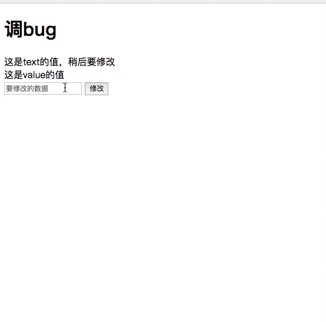

# my_regularjs
>网易内部很多项目都使用波神开发的框架 [regularjs](https://regularjs.github.io/guide/zh/)。所以自己将regularjs简单的实现了一遍，用于加深对regular的理解。

目前只实现了两点

- 初次渲染
> 解析`<div>{text}<div>`，其中包括`div`这种元素类型，及`{text}`这种简单的expression类型。

- 更新视图
> 在改变数据后，用 $update 进行更新的功能。

## Quick Start
```shell
 git clone git clone git@github.com:lingximu/my_regularjs.git
 cd my_regularjs
 npm install
 ## 用browser-sync代理index.hmtl查看效果
 npm start
 ## 如果对框架进行了改动，需要重新build
 npm build
```

## 说明

- 涉及的

> 涉及 Walker、watcher、lexer、Parser、AST，对reguarjs的项目基本结构与实现原理有了整体了解。在将来用到时可以较快的找到起作用的代码。从而明确功能或者修复bug.  

- 没有涉及的

> 没有涉及的，包括 属性、指令、list、if、事件、动画、事件 等等。对于这部分没有涉及的，主要是因为对用 Lexter、Parser 进行解析的结果不明确等造成的，需要花费大量的时间。而目前来看并不是很有必要。

## 效果

“初次渲染”+“视图更新”

